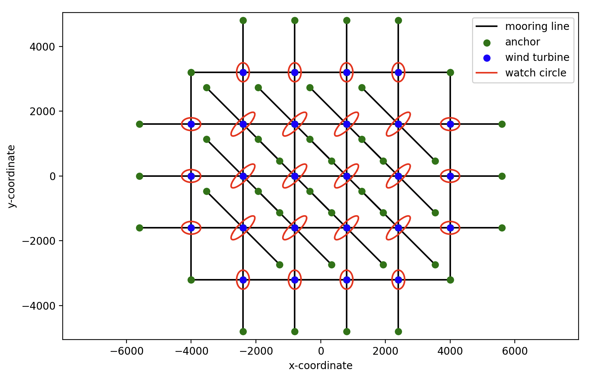

# Linear Shared Mooring Model (LSM)

An analytical linear model simulating mooring systems in large-scale repeated floating offshore wind farm arrays.

For instance, suppose you have a mooring system of 1 rank of periodicity in the x direction (that is, the central unit block is repeated once in the x direction):

\[ N = \begin{bmatrix} 1 & 0 \\ 0 & 0 \end{bmatrix} \]

The user has to define the lines making the unit cells making the blocks making the final array (see example 04_R1Nx with the input R1Nxx1.yaml) as shown in the figure:

